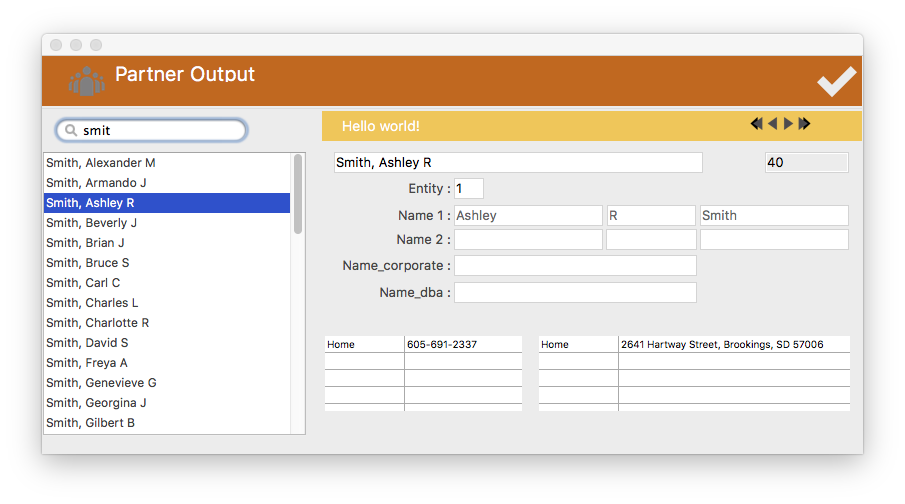

# Form-controllers-and-subforms
A 4D database demonstrating the use of form controllers and subforms.

You must have [4th Dimension](https://www.4d.com) v15 or greater installed to run it. 
* * *

### How do I make it work?

The database is a simple one of 'Partners'. It's a more specific approach to a Contacts database that supports identifying the legal entity of a Partner, name options, and more.  
It's prepopulated with records from [Fakename Generator](https://www.fakenamegenerator.com/).

### Enter records

Start by selecting Enter New Partner from the File menu.

This input form is made up of 5 subforms. One, the email input, is very simple while the name and address inputs are quite involved. To see how it works start with the Partner_new_record method. Notice you can set various options for how the new partner record is created. You can require an email, phone and or address for example, and the colored rectangle appears around that field.

I have it set to require an email so the red border will appear until it's filled in at which point the border turns green.

### View Records

Choose Show Records from the File menu. This form is a different take on the traditional output form. Type into the search widget to generate a list of some partners.

The display area is made up of four subforms. First is a header toolbar for the entire form located on page 0\. On page 1 there is another instance of the toolbar above the details area. Note the nav buttons in the toolbar - give them a try.  

There is the 4D search widget.  

Finally the display area is an extremely simple subform to illustrate how valuable they can be without any programming - there are no events and methods involved in that subform.  

Check out the form controller, Partner_outputForm_controller.

### Toolbars

The toolbar submenus can be configured via [json documents](Resources/tb) in the resources folder. If you look at the methods that set up these forms you'll see you have the option to load blank templates and configure them in code or do all the setup in the JSON. Or both. It's quite flexible.  
Buttons, pictures, nav buttons, setting the color of the background rectangle, and the title can all be controlled with the JSON.

### Form Controllers

Form controllers are simply project methods I route all the object scripts and the form method to. There are a number of advantages to this approach and they are used throughout this demo. Some are fairly simple as well as very complex ones. I think complex forms become much easier to degug when all the code it in one place. Managing dynamic variables is also quite a bit easier.

### Enjoy

Thanks for taking the time to play with this. Please let me know what you think and any issues you come accoss. Feel free to use anything you like.

For example, the Toolbar module can be copied directly to your projects. The web area module that manages this window is easily added as well.

#### Shameless self promotional plug

I enjoy doing this sort of work with 4D and am available and happy to discuss working with you on your projects. If you like what you see but don't have the time or interest to manage it yourself let's talk.

## Kirk Brooks

